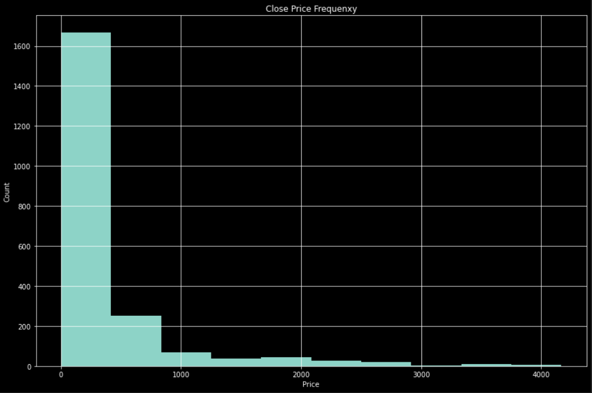
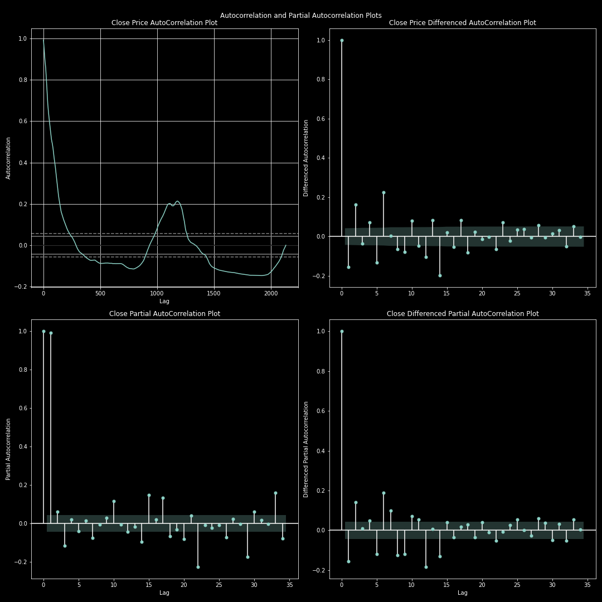
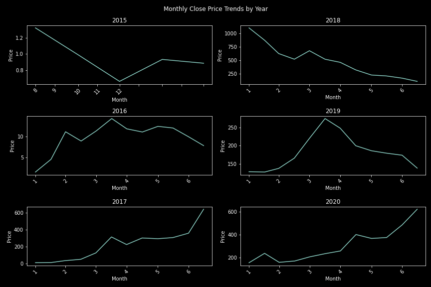
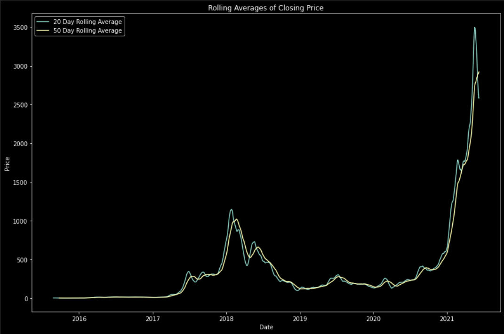

# Time-Series Forecasting Ethereum Prices

## Business Understanding
- Ethereum is a decentralized, open-source blockchain with smart contract functionality. Its adoption in the financial world has grown exponentially over the past few years, and as a result, its price has skyrocketed from being worth less than \$1 to over $2000 at the time of writing this page.
- Due to the uncertainty of decentralized finance, or DeFi, the value of Ethereum is highly volatile, which makes the use of traditional forecasting models such as ARIMA difficult

## Goal and Audience

- The goal of this project is to create a model that attempts to accurately predict if the value of Ethereum will go up or down for the next day. If the model predicts a rise, then one unit of Ethereum will be bought. If it predicts a fall, then one unit of Ethereum will be sold.

- The target audience of this project is an investment firm or a retail trader with extensive disposable income.
    - To consistently buy and sell one unit of Ethereum requires a large amount of liquidity, something that most retail investors do not have, hence the specification towards investment firms and the retail investors that fall in the highest percentiles of disposable income/liquidity.

At the end of this project, an evaluation/comparison will be made between the total profit of three different trading strategies by backtesting over the time period of the created test-set:
1. A strategy derived from the best-performing model construcred
2. A Simple Moving Average Model
3. The Buy-and-Hold Strategy

## Data Source

This data was scraped from CoinMarketCap.com using the webscraper Octoparse. The webpages used ajax syntax for the "load page" button, and therfore ajax timeout time needed to be applied in order to properly extract the data. This data is only concerned with Ethereum, and no other coin or blockchain.

## Features

The data includes the following features:

1. Open
2. High
3. Low
4. Close 
5. Volume
6. Market Cap
 

This dataset provides a timeline of Ethereum prices and related data from August 7th, 2015 to June 8th, 2021.
 

 

## Data Source

This data was scraped from CoinMarketCap.com using the webscraper Octoparse. The webpages used ajax syntax for the "load page" button, and therfore ajax timeout time needed to be applied in order to properly extract the data. This data is only concerned with Ethereum, and no other coin or blockchain.

## Features

The data includes the following features:

1. Open
2. High
3. Low
4. Close 
5. Volume
6. Market Cap
 

This dataset provides a timeline of Ethereum prices and related data from August 7th, 2015 to June 8th, 2021.
 

## Visualizations

- High occurrence of low prices

- Very low occurrence of high prices

- Distribution of prices shows that the price remained relatively stationary, then spiked briefly several times

- Using the ACF and PACF plots shown above, we can (uncertainly) conclude that an optimal value for p for an ARIMA model would be 1, and an optimal value for q for an ARIMA model would be 1 as well. You can identify this by the exaggreated correlation at the corresponding lag values. Auto-ARIMA will be used during the modeling process to optimize these parameters.

- The visual representations of the monthly price movement shows no particular seasonal trend. There is no season that seems to have more activity than the others across the years.

## EDA 

 - The rolling averages calculated from three different windows (30, 90, 365) provide some more insight to the data. As the window increases in size, the rolling averages' values have very different values during the highly volatile periods of the price of Ethereum. This volatility resulted in each of these periods having wildly different minimum and maximum values, which results in rolling averages that also different by quite a lot. Unsurprisingly, the 30-day and 90-day rolling averages were the most closely related, especially during the first period of steep upwards trend. The prices did not reach magnitude differences during these windows that warranted such a drastic rolling average difference. However, at the end of our time period, the rolling averages end up differing in value by almost $500, which goes to show the extreme volatility that Ethereum experienced during this time period (the most recent months when Ethereum had a meteoric rise). In short summary, the 365-day moving average had the lowest average value because it generalized the most volatility, however its final value was very below the true price. The 30-day moving average had the highest value because it strongly accounted for the high volatility, and its final value was a little higher than the true price (the extreme upper values pulled the average upwards). The 90-day moving average was the closest to the true price, showing that it both accounted for and generalized the volatility the best of the three windows!

- From the year 2015 to the first quarter of 2017, the price of Ethereum remained quite stationary, with a very strong rise starting between March and April, which led to a strong upwards trend that lasted throughout the rest of the year of 2017, bring the price to a maximum value of 826.82 by the end of the year. This constituted a 10,106 percent price increase from the minimum price of 8.17 in the year of 2017, which is by all standards a very strong upwards trend. The volume of trades also followed this trend quite closely, matching the sentiment idea that as an asset shoots up in price, more people attempt to join in on the ride, and hence more trades are made. After the year 2017, the price of Ethereum immediately started a strong downwards trend beginning in January of 2018, and by the end of 2018 the price had settled to a minimum value of 84.30, roughly a 94 percent drop from its all time high at the very beginning of 2018. Volume for the rest of 2018 remained on average higher than the two years afterwards and the year before because at first people were participating in frequent trades due to the meteoric rise in price, and then people continued to sell their coins over the year as the price tanked. From 2019 to mid-2020, the price once again mostly resumed the stationary trend that it had exemplified from 2015 to about a quarter of the way through 2017, indicating that perhaps people lost interest in the Ethereum block-chain, doubted its potential, or simply moved on to different investments. There was a sharp rise in prise to a little over $250 during 2019, but it just as quickly fell back to close to the minimum value of that year, failing to breakout of its strong downwards trend. The volume from 2019 to mid-2020 would never drop to the levels seen before the coin's meteoric rise, most likely because such a note-worthy event put Ethereum on the map permanently. During 2019, there was a sharp rise and fall in volume that mirrored the trend of the quick rise and fall of price during that year. 2019-2021 would be the period of time when Ethereum would consistently reflect a yearly upwards trend. Volume was higher than its ever been, and the price rose to an unprecedented level of roughly $4000. During this upwards trend, there were several downwards trends that occured during certain months of the years. They seemed to be relatively random, with no predictability in their occurences, highlighting the unstationarity of the price of Ethereum, and also the idea that the price follows a "cyclical trend". There are very clear bull and bear markets, however due to the lack of clear seasonality, predicting their beginnings and endings based solely on date is pretty much impossible.
 

### Stationarity
 

- The stationarity of the data was tested using an Augmented Dickey-Fuller Test. Before differencing, the ADF-Test gave a result that indicated that the data was strongly non-stationary. After first-order differencing, the ADF-Test gave a result that indicated the data was now stationary. 

## Modeling

A total of 5 models were run in the following order:
1. Random Walk
2. ARIMA (using the Auto-ARIMA package)
3. Prophet (without exogenous variables)
4. Prophet (with exogenous variables)
5. LSTM (without exogenous variables)

| Model          | RMSE   |
|----------------|--------|
| Random Walk    | 493.49 |
|                         |
| Auto-ARIMA     | 1053.25|
|                         |
| Prophet(No Exo)| 506.81 |  
|                         |
| Prophet(Exo)   | 277.92 |
|                         |
| LSTM (No Exo)  | 135.55 |

### Overall Results

The best performing model was the model with:
- 1 LSTM layer
- 256 units per layer
- Dropout specified within the LSTM layer rather than being a discrete layer itself

More complex models performed poorly in comparison to the one layer model.

The model predicted higher than actual prices for roughly the first 550 timesteps, and then predicted lower than actual prices for the remaining timesteps. 

Overall, the model predictions followed the trend of the actual prices quite closely, correctly timing (although very roughly) the sharp rises and falls in the price of Ethereum. Volatility is what makes trading Ethereum so difficult, and a model that can even roughly predict the highly volatile time periods of the asset can be very useful.
 

## Profit Calculations for Top Model Compared to Simple Moving Average Trading Strategy and Buy-and-Hold Strategy

### LSTM Strategy
The LSTM Trading Strategy is described as such:

*   When the model predicts a rise in value for the following day, one unit of Ethereum is bought

*   When the model predicts a decline in value for the following day, one unit of Ethereum is sold

#### Overall Performance

    * The final portfolio value of  $273,357.79
    * This is a total profit of $173,357.79
    * Increased original investment by 2.733x
 

### SMA Strategy

 The SMA Trading Strategy follows this logic

* When the moving average intersections indicate a buy opportunity, then one unit of Ethereum will be bought.
* When the moving average intersections indicate a sell opportunity, the one unit of Ethereum is sold.

#### Overall performance

    * Final portfolio value of $926,790.12
    * Total profit margin of $828,790.12
    * Multiplied initial investment by 9.268x
 

## Conclusion
 

- The contructed model that performed the best was the 1-layer LSTM model. When backtesting the model on the testing set's time frame, we saw a total profit of \$173,357.79 , which corresponded to a 2.733x increase in the original investment of \$100,000
 

- The LSTM model's profit was compared to the profit generated by that of one of the most common and effective trading strategies used in the trading world; Simple Moving Average. The SMA Trading stretegy saw a total profit of \$828,790.12 , which corresponded to a 9.268x increase in the original investment of \$100,000
 

- The SMA Trading Strategy had a clear advantage over that of the LSTM Trading Strategy; the SMA strategy had periods of time where the investment was held rather than bought or sold, allowing it to ride upward trends and increase in value during the high volatiity periods of the price movement. The LSTM strategy seemed to suffer from the constant buying and selling of the asset, with no periods of holding.
 

- The buy-and-hold strategy outperformed both the LSTM strategy and the SMA Straegy. 
        - It outperformed the LSTM strategy by roughly 4.92x
        - It out performed the SMA Trading Strategy by roughly 1.03x
        
### Takeaway
- The takeaway from this project is that although it is possible to construct a decently accurate model to predict the prices of Ethereum a day in the future and create a trading strategy based off of those findings, the most reliable strategy is the classic investing adage: "BUY AND HOLD"

## Further Ideas
- Create an app that allows for users to predict future date's prices with the model easily, without needing to manually run any code
- Collect data on tighter time frames, such as hours or minutes, in order to substantially increase the amount of data, potentially improving our RMSE metrics for the models
- Add further exogenous variables to both Prophet and LSTM