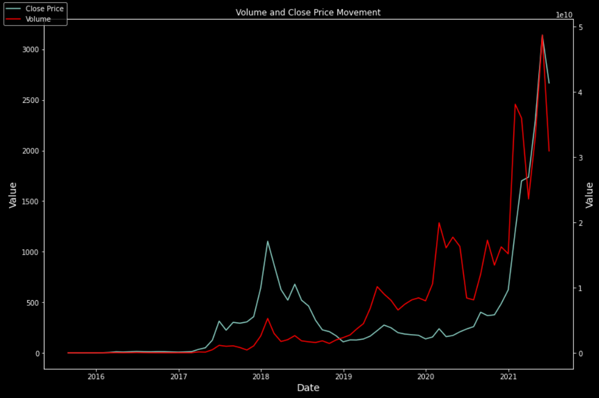

# Time-Series Forecasting Ethereum Prices

## Business Understanding
- Ethereum is a decentralized, open-source blockchain with smart contract functionality. Its adoption in the financial world has grown exponentially over the past few years, and as a result, its price has skyrocketed from being worth less than \$1 to over $2000 at the time of writing this page.
- Due to the uncertainty of decentralized finance, or DeFi, the value of Ethereum is highly volatile, which makes the use of traditional forecasting models such as ARIMA difficult

## Goal and Audience

- The goal of this project is to create a model that attempts to accurately predict if the value of Ethereum will go up or down for the next day. If the model predicts a rise, then one unit of Ethereum will be bought. If it predicts a fall, then one unit of Ethereum will be sold.

- The target audience of this project is an investment firm or a retail trader with extensive disposable income.
    - To consistently buy and sell one unit of Ethereum requires a large amount of liquidity, something that most retail investors do not have, hence the specification towards investment firms and the retail investors that fall in the highest percentiles of disposable income/liquidity.

At the end of this project, an evaluation/comparison will be made between the total profit of three different trading strategies by backtesting over the time period of the created test-set:
1. A strategy derived from the best-performing model constructed
2. A Simple Moving Average Model
3. The Buy-and-Hold Strategy

## Data Source

This data was scraped from CoinMarketCap.com using the webscraper Octoparse. The webpages used ajax syntax for the "load page" button, and therfore ajax timeout time needed to be applied in order to properly extract the data. This data is only concerned with Ethereum, and no other coin or blockchain.

## Features

The data includes the following features:

1. Open
2. High
3. Low
4. Close 
5. Volume
6. Market Cap
 

This dataset provides a timeline of Ethereum prices and related data from August 7th, 2015 to June 8th, 2021.
 

 

## Data Source

This data was scraped from CoinMarketCap.com using the webscraper Octoparse. The webpages used ajax syntax for the "load page" button, and therfore ajax timeout time needed to be applied in order to properly extract the data. This data is only concerned with Ethereum, and no other coin or blockchain.

## Features

The data includes the following features:

1. Open
2. High
3. Low
4. Close 
5. Volume
6. Market Cap
 

This dataset provides a timeline of Ethereum prices and related data from August 7th, 2015 to June 8th, 2021.
 

## Visualizations

- High occurrence of low prices

- Very low occurrence of high prices

- Distribution of prices shows that the price remained relatively stationary, then spiked briefly several times

- Using the ACF and PACF plots shown above, we can (uncertainly) conclude that an optimal value for p for an ARIMA model would be 1, and an optimal value for q for an ARIMA model would be 1 as well. You can identify this by the exaggreated correlation at the corresponding lag values. Auto-ARIMA will be used during the modeling process to optimize these parameters.

- The visual representations of the monthly price movement shows no particular seasonal trend. There is no season that seems to have more activity than the others across the years.

## EDA 

Rolling Averages:

These are the the windows that will be used for the Simple Moving Average model comparison.

These are the two main features we will be using:
- Closing Price
- Volume

### Stationarity
 

- The stationarity of the data was tested using an Augmented Dickey-Fuller Test. Before differencing, the ADF-Test gave a result that indicated that the data was strongly non-stationary. After first-order differencing, the ADF-Test gave a result that indicated the data was now stationary. 

## Modeling

A total of 5 models were run in the following order:
1. Random Walk
2. ARIMA (using the Auto-ARIMA package)
3. Prophet (without exogenous variables)
4. Prophet (with exogenous variables)
5. LSTM (without exogenous variables)

| Model          | RMSE   |
|----------------|--------|
| Random Walk    | 493.49 |
|                         |
| Auto-ARIMA     | 1053.25|
|                         |
| Prophet(No Exo)| 506.81 |  
|                         |
| Prophet(Exo)   | 277.92 |
|                         |
| LSTM (No Exo)  | 135.55 |

### Overall Results

The best performing model was the model with:
- 1 LSTM layer
- 256 units per layer
- Dropout specified within the LSTM layer rather than being a discrete layer itself

More complex models performed poorly in comparison to the one layer model.

The model predicted higher than actual prices for roughly the first 550 timesteps, and then predicted lower than actual prices for the remaining timesteps. 

Overall, the model predictions followed the trend of the actual prices quite closely, correctly timing (although very roughly) the sharp rises and falls in the price of Ethereum. Volatility is what makes trading Ethereum so difficult, and a model that can even roughly predict the highly volatile time periods of the asset can be very useful.
 

## Profit Calculations for Top Model Compared to Simple Moving Average Trading Strategy and Buy-and-Hold Strategy

### LSTM Strategy
The LSTM Trading Strategy is described as such:

*   When the model predicts a rise in value for the following day, one unit of Ethereum is bought

*   When the model predicts a decline in value for the following day, one unit of Ethereum is sold

#### Overall Performance

    * The final portfolio value of  $273,357.79
    * This is a total profit of $173,357.79
    * Increased original investment by 2.733x
 

### SMA Strategy

 The SMA Trading Strategy follows this logic

* When the moving average intersections indicate a buy opportunity, then one unit of Ethereum will be bought.
* When the moving average intersections indicate a sell opportunity, the one unit of Ethereum is sold.

#### Overall performance

    * Final portfolio value of $926,790.12
    * Total profit margin of $828,790.12
    * Multiplied initial investment by 9.268x
 

## Conclusion
 

- LSTM Profit = $173,357.79
 

- SMA Profit = $828,790.12
 

- Buy-and-Hold = $853,250.79
 
        
### Takeaway
- The takeaway from this project is that although it is possible to construct a decently accurate model to predict the prices of Ethereum a day in the future and create a trading strategy based off of those findings, the most reliable strategy is the classic investing adage: "BUY AND HOLD"

## Further Ideas
- Create an app that allows for users to predict future date's prices with the model easily, without needing to manually run any code
- Collect data on tighter time frames, such as hours or minutes, in order to substantially increase the amount of data, potentially improving our RMSE metrics for the models
- Add further exogenous variables to both Prophet and LSTM
- Construct a much more fleshed-out trading strategy using the LSTM model. This may substantially increase profit potential.